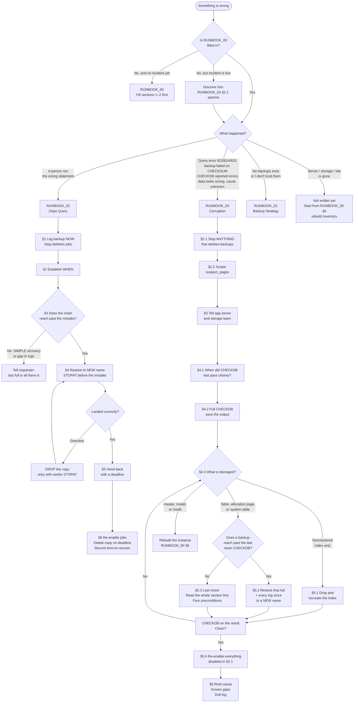

[README.md](https://github.com/user-attachments/files/31884954/README.md)
# runbooks/

Recovery procedures for a SQL Server instance, plus the drills that test them.

## The set

| File | What it is | Open it when |
|---|---|---|
| `RUNBOOK_00_recovery_planning.md` | RPO/RTO, tooling inventory, retention derivation, detection controls, contacts, rebuild inventory | Before anything else. Filled in while calm, reviewed on a schedule |
| `RUNBOOK_01_backup_strategy.md` | Designing and implementing backups from the RPO/RTO | Setting up a server that has no backups, or replacing ones you don't trust |
| `RUNBOOK_02_oops_query.md` | Point-in-time restore after someone ran the wrong statement | A person made a mistake and the database is otherwise healthy |
| `RUNBOOK_03_corruption.md` | Detection, scope, recovery decision tree, last resort | The data is wrong at the page level |
| `DRILL_backup_strategy.md` | Exercise for Runbook 01 | — |
| `DRILL_corruption.md` | Exercise for Runbook 03, with five variants | — |

The drill for Runbook 02 is `lab/L01_point_in_time.sql`.

## Which runbook, and which section

Every node names the section to open. You are not meant to read a runbook
front to back — land where the arrow points.

Three loops are drawn deliberately: oops-query overshoot (retry with an earlier
`STOPAT`), corruption re-check (CHECKDB again after any fix), and the fact that
both runbooks return to a re-enable step before closing out. Those loops are
the trial-and-error the prose describes in paragraphs, here as arrows.

**Not on this chart:** high availability and disaster recovery. Both need
infrastructure this server may not have. `RUNBOOK_00_recovery_planning.md`
section 6 is the starting inventory for a DR runbook, not yet written.

## Reading order

**00 first.** Every other runbook references it. If its section 1 — the RPO/RTO
grid — is empty, the others are guesswork.

Then whichever runbook matches the situation. They are written to stand alone
once 00 exists.

## How the drills work

Each drill is one scenario, start to finish, on a sample database. Every step
asks you to **predict before you run.** Being wrong is the point — a prediction
you got wrong is remembered; an instruction you followed is not.

The drills produce the runbooks' drill logs. A runbook nobody has followed end
to end against a deliberately broken database is untested, and says so on the
page.

## Conventions

| Marker | Meaning |
|---|---|
| `--!REPLACE` | Set before running |
| `!OPT:` | Depends on a decision the document cannot make |
| `<!-- -->` | A prompt to answer, invisible in preview. Search for `<!--` before calling a runbook finished |

## What this set does not cover

**High availability** and **disaster recovery** — the other two columns of the
RPO/RTO grid. Both need infrastructure this server may not have (availability
groups, log shipping, a second site). Runbook 00 section 6 is the start of a DR
runbook: the inventory of what would have to be rebuilt by hand.

## Why runbooks rather than memory

Brent Ozar reads the documentation every time he does a restore, and he has
been doing this for decades. The commands are not meant to be remembered. What
professionals have instead is a written procedure, produced while calm, tested
against a broken database, and kept next to the thing it describes.
